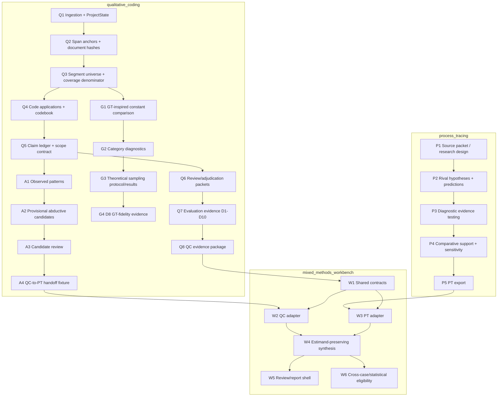

# Capability Dependency Graph

**Status:** Active planning artifact
**Last updated:** 2026-06-25

This graph defines the capability order for `qualitative_coding`, its
grounded-research path, and the future `mixed_methods_workbench` seam with
`process_tracing`.

It is not a replacement for `docs/PROJECT_THEORY_AND_GOALS.md` or
`docs/EVALUATION_HARNESS.md`. Those remain canonical for claim discipline,
architectural invariants, and evaluation metrics. This document answers a
different operational question: **what has to exist, in what order, with what
success criteria, before a later capability is allowed to become central?**

## Frame

The workbench should not treat abductive reasoning or process tracing as the
next layer until the qualitative evidence substrate can support them. The core
dependency principle is:

```text
anchored qualitative evidence -> reviewed claims/patterns -> evaluation evidence
  -> optional abductive candidates -> process-tracing adapter
  -> mixed-methods synthesis
```

Abductive reasoning is downstream. It can be useful, but it should not become
product-central before the QC and grounded-research foundations are credible.

## Boundary Graph



## Capability Table

| ID | Capability | Owner | Depends on | Current status | Success criteria | Verification / artifact | Claim licensed when passing |
|---|---|---|---|---|---|---|---|
| Q1 | Ingestion + `ProjectState` | QC | none | Implemented | Supported file types load into one typed state; failures are explicit. | deterministic tests; `project run` smoke/e2e | Software can ingest and persist project state. |
| Q2 | Span anchors + document hashes | QC | Q1 | Mostly met | Evidence quotes resolve to document ID, char offsets, and hash; unresolvable/ambiguous quotes are dropped or warned. | `make bench` D1; `verify_grounding` | Evidence is inspectable and anchored, not methodologically validated. |
| Q3 | Segment universe + coverage denominator | QC | Q1, Q2 | Met in exhaustive mode; partial by default | Every segment has a stable ID and offsets; exhaustive mode records `coded` / `no_code` / `not_examined`. | `make bench` D2; `project run --exhaustive` | Coverage denominator exists; not code validity. |
| Q4 | Code applications + codebook | QC | Q2, Q3 | Implemented | Codes and applications preserve provenance, anchors where available, and codebook version. | unit/e2e tests; exports | Software coding workflow exists; not application correctness. |
| Q5 | Claim ledger + corpus scope | QC | Q2, Q4 | Mostly met object layer | Every substantive assertion can be represented as a typed claim with scope, support status, anchors, contrary anchors, and review state. | `project claims`; API/MCP; `make bench` claim-anchor coverage | Claims are inspectable and scoped; not true or human-retained. |
| Q6 | Review/adjudication packets | QC | Q4, Q5 | Partial | Codes, applications, claims, relationships, negative cases, and abductive candidates can be sampled/reviewed through typed packets and decisions. | adjudication sample/protocol/response preflight commands | Review workflow exists; not expert validity until populated. |
| Q7 | Evaluation evidence D1-D10 | QC | Q2-Q6 | Phase 0 substrate built; populated evidence mostly missing | D3/D4/D6/D7/D8/D9/calibration protocols are frozen, populated, preflighted, scored, and caveated. | `docs/EVALUATION_HARNESS.md`; `make bench`; benchmark artifacts | Per-dimension evidence only, never blanket SOTA. |
| Q8 | Trusted QC evidence package | QC | Q5-Q7 | Partial | Export contains scope, claims, anchors, caveats, hashes, review state, and benchmark/evaluation references. | export manifest + publish preflight + scorecard package | Package can support downstream review; not causal proof. |
| G1 | GT-inspired constant comparison on canonical segments | QC | Q3, Q4 | Implemented | GT path consumes canonical segments and preserves one denominator. | GT tests; segment compatibility tests | GT-inspired coding substrate exists. |
| G2 | Category diagnostics | QC | G1 | Partial | Category property/dimension/application/document support is reported separately from codebook stability. | saturation diagnostics; `make bench` | Diagnostic guidance exists; not saturation proof. |
| G3 | Theoretical sampling protocol/results | QC | G2 | Protocol/package substrate built; populated execution missing | Protocol, candidate package, selected result, and preflight are run on real or shareable data. | theoretical-sampling validate/export/preflight commands | Sampling workflow evidence, not adequacy by itself. |
| G4 | D8 GT-fidelity evidence | QC | G1-G3, Q7 | Protocol substrate only | Expert rubric outcomes under a pre-registered protocol pass the stated criteria. | D8 protocol/result/preflight/scorecard package | Stronger GT-fidelity claim for the evaluated scope. |
| A1 | Observed patterns | QC | Q4, Q5 | Implemented | Cross-document/pattern outputs are first-class descriptive records with anchors where available. | `project patterns`; API/Markdown | Descriptive pattern accounting only. |
| A2 | Provisional abductive candidates | QC | A1, Q5 | Implemented opt-in | Candidates retain source pattern IDs, rivals, implications, evidence gaps, confidence caveats. | `project run --abductive`; candidate read surfaces | Hypothesis-generation surface only. |
| A3 | Candidate review | QC | A2, Q6 | First slice implemented | Candidates can be listed, approved to `needs_evidence_review`, rejected, or modified in bounded fields. | review API/CLI tests | Governed candidate review, not causal validation. |
| A4 | QC-to-PT handoff fixture | QC | A1-A3, Q5 | Accepted as QC-side fixture | Strict schema exports scope, documents, patterns, candidates, claims, anchors, caveats; rejects PT inference fields. | `make validate-process-tracing-handoff`; consumer review 2026-06-25 | Acceptable adapter input; not runnable PT analysis. |
| P1 | Source packet / research design | PT | external research design, optional Q8/A4 context | Implemented in PT | Research question, focal window, outcome, source candidates, gaps, and pre-specified tests are explicit. | PT source-packet validation | Runnable PT scope exists. |
| P2 | Rival hypotheses + predictions | PT | P1 | Implemented | Mutually discriminating hypotheses and observable predictions are generated/reviewed. | PT pipeline/tests/live runs | Hypothesis space exists, not support result. |
| P3 | Diagnostic evidence testing | PT | P1, P2 | Implemented | Evidence-by-hypothesis likelihood vectors are coherent and validated. | PT pass 3 validation; live run | Diagnostic matrix exists. |
| P4 | Comparative support + sensitivity | PT | P3 | Implemented | Deterministic update, sensitivity, robustness, and caveats are emitted without conflating support with probability of truth. | PT result/report/audit | Comparative within-case support. |
| P5 | PT export | PT | P4 | Planned/needed | Versioned export exposes source scope, hypotheses, comparative support, absence findings, verdicts, and metadata without raw internals. | future `pt_export_v1.json` | PT results can be consumed by workbench. |
| W1 | Shared contracts | Workbench | Q8/A4, P1/P5 stubs | Planning scaffold | Pydantic-style contracts cover source scope, anchors, evidence records, assertions, patterns, hypotheses, and estimands. | `mixed_methods_workbench/contracts/shared_contracts.md`; future tests | Contract readiness only. |
| W2 | QC adapter | Workbench | Q8 or A4, W1 | Planned | QC artifacts map without lossy anchors/caveats and without importing PT internals into QC. | fixture-backed adapter tests | QC evidence can enter workbench. |
| W3 | PT adapter | Workbench | P5, W1 | Planned | PT export maps without flattening comparative support into generic confidence. | fixture-backed adapter tests | PT results can enter workbench. |
| W4 | Estimand-preserving synthesis | Workbench | W2, W3 | Planned | Synthesis shows qualitative support, PT comparative support, and future causal effects as distinct estimands. | review payload tests; concern checks | Mixed-methods synthesis surface exists. |
| W5 | Review/report shell | Workbench | W4 | Planned | User can trace from question -> evidence -> claim/pattern -> hypothesis -> report with caveats visible. | UI/API snapshot or demo fixture | Reviewer workflow exists. |
| W6 | Cross-case/statistical eligibility | Workbench | W4, future data | Dependency subplan | Eligibility criteria decide when QCA/CausalQueries/statistical adapters are appropriate. | future protocol + adapter tests | Cross-case bridge readiness, not effect evidence. |

## Recommended Build Order

1. **QC foundation hardening:** Q2-Q6, then a small real/shareable corpus and
   adjudication seed. This should precede more abductive UI work.
2. **Grounded-research legitimacy:** G1-G4 only if the project wants stronger
   grounded-theory claims. Otherwise keep the label "GT-inspired."
3. **Evidence packages:** Q7-Q8 with populated D3/D7 and at least one benchmark
   artifact over the seed corpus.
4. **Abductive reasoning:** A1-A4 stays optional and downstream. Do not let it
   become the main proof layer.
5. **Workbench adapter:** W1-W3 after Q8/A4 and PT export stubs stabilize.
6. **Mixed-methods synthesis:** W4-W6 after adapter tests prove no estimand
   flattening or anchor loss.

## Success-Criteria Policy

Every capability needs two kinds of success criteria:

- **Software success:** the feature exists, is typed, is tested, is agent-drivable,
  and fails loudly.
- **Methodological success:** the feature has frozen inputs, protocols, reviewer
  or benchmark evidence, confidence intervals where relevant, and claim-discipline
  caveats.

Do not promote a capability from "implemented" to "validated" unless the second
bar is met.

## Skill Integration Recommendation

This capability graph methodology should be integrated into `design-plan`, but
as a **reference protocol**, not by bloating the main `SKILL.md`.

Recommended change:

1. Add a `references/capability-dependency-graph.md` file to the `design-plan`
   skill.
2. In the main `design-plan` skill, trigger that reference when a user asks for
   a roadmap, ecosystem plan, multi-repo architecture, product capability order,
   or "what should we build first?"
3. Require the graph for any plan that crosses more than one repo, more than one
   method engine, or more than one evaluation claim.

The reference should require this template:

| Field | Meaning |
|---|---|
| Capability ID | Stable short ID, e.g. `Q5`, `P3`, `W2`. |
| Capability | User-visible or system-level capability. |
| Owner | Repo or subsystem that owns it. |
| Depends on | Capability IDs that must be true first. |
| Current status | Planned, partial, implemented, validated, blocked. |
| Success criteria | Concrete pass/fail or exploratory readout. |
| Verification artifact | Test, command, benchmark, fixture, protocol, or review. |
| Claim licensed | What can be truthfully said after it passes. |

The important addition to `design-plan` is not the table itself; it is the rule:
**later capabilities cannot become central until their dependency capabilities
license the claims they rely on.**

For this project, that rule means abductive reasoning and mixed-methods
synthesis stay downstream of the QC/grounded-research foundations.
