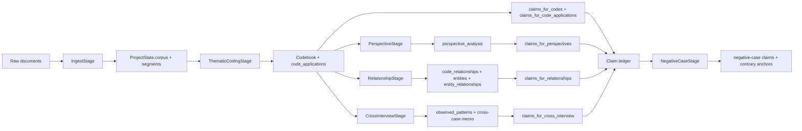
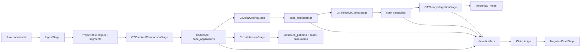

# Pipeline Prompt And Dataflow Audit

Wiki home: http://localhost:8088/index.php/Project_Wiki

**Status:** Active audit artifact
**Last updated:** 2026-06-25

This document audits the current repo from four angles:

1. data flow through the default and GT pipelines;
2. where prompts directly shape analytic objects;
3. where claim/position structure is currently strengthened or flattened;
4. what changes are likely to improve methodological usefulness.

## Executive Findings

The repo has a stronger typed substrate than prompt/dataflow documentation.
The main methodology risk is structural:

- the default path starts with **theme-first code discovery**;
- claims become first-class later, mostly by deterministic mirroring from domain
  objects;
- the current UX foregrounds graphs and code/theme structure more than
  claim/position structure;
- therefore the pipeline is better at showing **what the corpus is about** than
  **what bounded positions and claims the corpus contains**.

## Default Pipeline Data Flow

### Key Structural Fact

Claims are not the first-class output of the early default pipeline prompt
stack. They are mostly formed later from:

- codes;
- code applications;
- perspective output;
- relationships;
- cross-interview patterns;
- synthesis output.

That design is defensible for auditability, but it means any weakness in the
upstream ontology propagates into the claim ledger.

## GT-Inspired Pipeline Data Flow

The GT path is structurally closer to claim-bearing theory work than the
default path, but the repo already documents that it is still
grounded-theory-inspired rather than full grounded theory.

## Prompt Surface Inventory

Current prompt-producing stages that matter most for analytic ontology:

| Stage | File | Current emphasis | Main risk |
|---|---|---|---|
| Thematic coding | `qc_clean/core/pipeline/stages/thematic_coding.py` | discover 10-15 hierarchical themes/codes with example quotes | topic/theme structure is primary; position/claim structure is implicit |
| Perspective | `qc_clean/core/pipeline/stages/perspective.py` | emphasized codes, consensus themes, divergent viewpoints | positions are discussed, but still mediated through code emphasis rather than first-class claim extraction |
| Relationship | `qc_clean/core/pipeline/stages/relationship.py` | code relationships plus entity relationships | better than before, but still not a claim/stance graph |
| Synthesis | `qc_clean/core/pipeline/stages/synthesis.py` | findings, patterns, recommendations, confidence | claims become broad and corpus-level; anchoring pressure increases |
| Negative case | `qc_clean/core/pipeline/stages/negative_case.py` | adversarial challenge to live claim targets | good claim-aware pressure step, but late in pipeline |
| GT constant comparison | `qc_clean/core/pipeline/stages/gt_constant_comparison.py` | segment-level coding against evolving codebook | stronger local grounding, but still coding-first |

### Prompt Override Registry

Custom prompt overrides are currently declared only for:

- `thematic_coding`
- `gt_constant_comparison`

in `qc_clean/core/prompt_override_registry.py`.

That means most higher-order interpretive stages are still governed only by
hard-coded prompt builders. The upside is consistency. The downside is that the
repo has not yet formalized a prompt-surface strategy for claim/position-aware
experimentation.

## Prompt Findings

### 1. Thematic coding is explicitly theme-first

The default prompt asks for:

- “key themes, patterns, and insights”
- a hierarchical code structure
- roughly 10-15 total codes
- example quotes and mention counts

See `qc_clean/core/pipeline/stages/thematic_coding.py`.

This is useful for building a codebook. It is weaker for:

- stance polarity;
- contested interpretations;
- attribution conflicts;
- evaluative claims;
- bounded participant positions.

### 2. Perspective analysis partially recovers positions, but late

The perspective stage does explicitly ask for:

- strongest positions;
- divergent viewpoints;
- internal tensions for single speakers.

See `qc_clean/core/pipeline/stages/perspective.py`.

That is a better fit for position-bearing analysis. But it happens after the
repo has already organized the corpus primarily as codes/themes.

### 3. Cross-interview analysis is descriptive, not stance-first

Cross-interview analysis is mostly deterministic accounting over:

- shared codes;
- consensus codes;
- divergent codes;
- code co-occurrence.

See `qc_clean/core/pipeline/stages/cross_interview.py`.

That is valuable, but it is not a direct model of:

- rival claims;
- support/contradiction between claims;
- actor-position maps;
- claim prevalence by speaker/group.

### 4. Claims are strong as objects, weaker as a first-class analytic center

The claim ledger is robustly typed. It already supports:

- kinds;
- scope;
- supporting and contrary anchors;
- adjudication state;
- revision history.

See `qc_clean/core/claims.py` and `qc_clean/schemas/domain.py`.

But the repo still lacks:

- a claims graph;
- claim-to-claim relation extraction;
- claim-to-speaker/group visualization;
- a prompt stage where claims/positions are clearly primary rather than
  derivative.

## UX And Documentation Findings

Current strengths:

- claim review surface exists;
- graph surface is more truthful than before;
- export and adjudication surfaces are much stronger than in most early-stage
  research tools.

Current weaknesses:

- no canonical prompt/dataflow audit doc existed before this one;
- no canonical SOTA/labor-limit doc existed before this one;
- review and graph surfaces still make it easier to inspect codes and
  relationships than to inspect competing positions and claims as structured
  networks;
- there was no single diagram showing where claims actually emerge.

## Recommended Improvement Directions

### Near-Term

1. Add a claim/position-aware default-path design target.
2. Make claims more visible in reviewer workflows than they are now.
3. Add a claim/position diagram and terminology into canonical methodology
   docs.
4. Treat theme-first prompts as necessary but insufficient.

### Medium-Term

1. Add a dedicated claim/position extraction stage, or strengthen perspective
   and cross-interview outputs so they emit more explicit bounded positions.
2. Add claim-to-claim and claim-to-speaker/group relations.
3. Add a claims graph or stance map surface.
4. Add evaluation criteria for interpretive usefulness of claims, not just code
   stability or graph population.

### Prompt-Level Candidates

1. In thematic/default analysis, explicitly ask not only “what themes recur?”
   but also:
   - what is being asserted?
   - by whom?
   - with what polarity or evaluative stance?
   - against what alternative framing?
2. Add explicit differentiation between:
   - topic/theme labels
   - claims/positions
   - evidence excerpts
   - uncertainty or contradiction
3. Avoid using mention counts or broad theme aggregation as proxies for
   analytical importance when the question is interpretive stance.

## Audit Conclusion

The current repo is not missing methodology awareness entirely. It already has:

- claim discipline;
- a first-class claim ledger;
- disconfirmation surfaces;
- review and adjudication infrastructure.

The core problem is that the **default prompt/dataflow stack still makes codes
the center of gravity** and treats claims as important but somewhat downstream.

That is the main design pressure that should now shape follow-on implementation.
