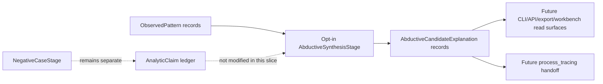
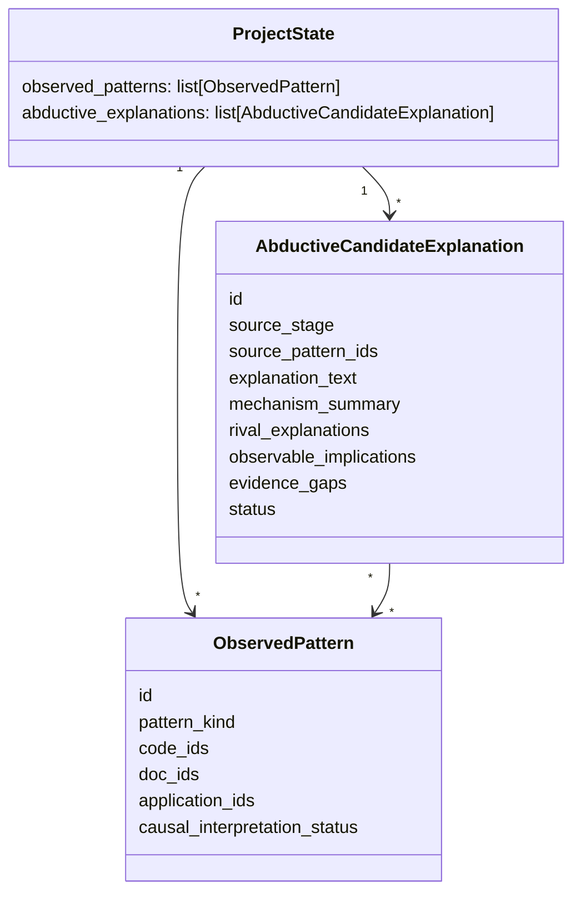
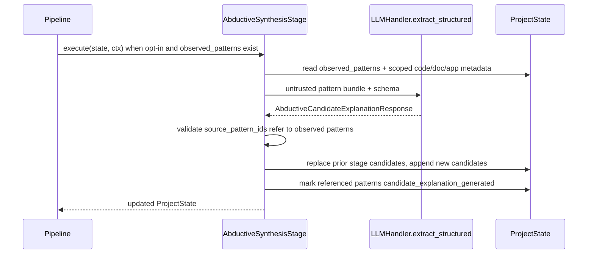

# Plan #228: Abductive Candidate Explanation Substrate

## Outcome

Completed 2026-06-25. Added an opt-in abductive candidate explanation
substrate. `ProjectState.abductive_explanations` now persists typed
`AbductiveCandidateExplanation` records with source pattern IDs, mechanism
summaries, rival explanations, observable implications, evidence gaps,
provisional confidence, and candidate status. `project run --abductive` inserts
`AbductiveSynthesisStage` after cross-interview analysis and before negative
case analysis in both default and GT pipelines; default pipeline order remains
unchanged. The stage validates candidate source pattern IDs, fails loudly on
unknown references, marks referenced observed patterns
`candidate_explanation_generated`, and writes a caveated methodological memo.
These are provisional hypotheses for review and future process-tracing handoff,
not causal proof, process-tracing results, methodological-validity evidence, or
SOTA evidence.

Verification:

- `python -m pytest tests/test_abductive_synthesis.py tests/test_pipeline_stages.py -q` — 29 passed.
- `python -m pytest tests/test_project_commands.py::TestProjectRun::test_run_project_records_wall_clock_timing tests/test_project_commands.py::TestProjectRun::test_run_project_records_wall_clock_timing_on_failure tests/test_abductive_synthesis.py -q` — 7 passed.
- `python -m ruff check qc_clean/schemas/domain.py qc_clean/schemas/analysis_schemas.py qc_clean/core/pipeline/stages/abductive_synthesis.py qc_clean/core/pipeline/pipeline_factory.py qc_clean/core/cli/commands/project.py qc_cli.py tests/test_abductive_synthesis.py` — passed.
- `make docs-check` — passed.
- `git diff --check` — passed.
- `make check` — 1336 passed, 1 skipped, 8 deselected; Ruff/docs passed; type check not configured.

**Status:** Complete
**Type:** implementation
**Priority:** High
**Blocked By:** #226, #227
**Blocks:** Process-tracing handoff bundle, mixed-methods workbench integration, richer abductive synthesis, causal-hypothesis review

---

## Frame

**Goal:** Add the first opt-in abductive layer: observed descriptive patterns can
be transformed into typed, provisional candidate explanations with rival
explanations, observable implications, and evidence gaps. These are hypotheses
for review and later process tracing, not claims of causality.

**Constraints:**

- Default pipeline cost and behavior must not change; the stage is opt-in.
- Candidate explanations must be typed and persisted in `ProjectState`, not
  buried in memos.
- The stage may use LLM semantic judgment, but all source material must be
  structured and explicitly treated as data.
- No candidate explanation may be reported as causal proof, validated theory,
  process-tracing result, methodological-validity evidence, or SOTA evidence.
- The existing negative-case stage remains the disconfirmation mechanism; this
  slice does not fold candidates into disconfirmation automatically.

**Borrow vs build:** Build the narrow local stage. There is no existing local
abductive-explanation contract to reuse, and the hard part is repo-specific
provenance over `ObservedPattern`, code/document/application scope, and future
process-tracing handoff. Reuse the repo's existing `PipelineStage`,
`LLMHandler.extract_structured`, `format_untrusted_data_block`, Pydantic schema,
and plan/docs patterns.

**Clean-docs note:** Plan #226 created pattern storage and Plan #227 created
read surfaces. This plan extends that chain without revising the claim-discipline
ledger except to record the new provisional status.

---

## Modality Split

- **Deductive / plan-first:** state model, LLM response schema, stage placement,
  opt-in CLI/pipeline flag, provenance fields, status vocabulary, tests, docs.
- **Exploratory / ladder:** explanation quality, number of candidates per
  pattern, and downstream review/evaluation thresholds. This slice records
  observable implications and evidence gaps so later slices can inspect failure
  modes before fixing thresholds.

**Exploratory readout for this slice:** On a synthetic two-pattern project, the
stage emits structurally valid candidates that preserve source pattern IDs,
include at least one rival explanation/evidence gap/observable implication per
candidate, and keep all candidates in provisional status. The readout is
structure + traceability, not explanation correctness.

---

## Boundary Diagram

---

## Domain Model Diagram

---

## Data Flow Diagram

Failure semantics:

- No observed patterns: stage skips without writing candidates.
- LLM output fails schema validation: existing `LLMHandler.extract_structured`
  failure path applies.
- Candidate references an unknown pattern ID: fail loudly with `ValueError`.
- Opt-in flag absent: pipeline remains unchanged.

---

## References Reviewed

- `docs/PROJECT_THEORY_AND_GOALS.md` - roadmap, claim discipline, observed
  pattern caveats, abductive/process-tracing direction.
- `docs/plans/completed/OBSERVED_PATTERN_SUBSTRATE.md` - prior pattern model
  plan and deferred abductive synthesis note.
- `docs/plans/completed/OBSERVED_PATTERN_READ_SURFACES.md` - current read
  surfaces and caveats.
- `qc_clean/schemas/domain.py` - `ObservedPattern`, `CausalInterpretationStatus`,
  and `ProjectState`.
- `qc_clean/core/pipeline/stages/cross_interview.py` - pattern producer.
- `qc_clean/core/pipeline/stages/synthesis.py` - current LLM stage structure.
- `qc_clean/core/pipeline/pipeline_factory.py` - default/GT pipeline stage
  insertion points.
- `qc_clean/core/pipeline/pipeline_engine.py` - `PipelineContext` and LLM call
  options.
- `qc_clean/schemas/analysis_schemas.py` - LLM-facing schema style.
- Memory context: recent plan sequence is encoded in completed plan docs; no
  relevant active memory decision was found for observed-pattern read surfaces.

---

## Research Basis For This Slice

No additional external research is needed for this narrow implementation slice.
The methodological framing comes from the repo's existing theory doc and the
previously reviewed causal/process-tracing alignment notes. External prior art
will matter before claiming evaluation quality, but this plan only creates a
typed, opt-in, provisional candidate object and stage.

---

## Capabilities

Skipped as a formal cross-project contract in this slice. The future
process-tracing/workbench handoff should define a Pydantic boundary package
after candidate rows exist and their shape has survived review.

---

## Files Affected

- `qc_clean/schemas/domain.py` - add candidate explanation model/status and
  `ProjectState.abductive_explanations`.
- `qc_clean/schemas/analysis_schemas.py` - add LLM-facing candidate explanation
  response schema.
- `qc_clean/core/pipeline/stages/abductive_synthesis.py` - new opt-in stage.
- `qc_clean/core/pipeline/pipeline_factory.py` - optional stage insertion before
  `NegativeCaseStage`.
- `qc_clean/core/cli/commands/project.py` and `qc_cli.py` - `project run`
  `--abductive` opt-in flag if existing command plumbing supports it locally.
- `tests/test_abductive_synthesis.py` - focused stage/model tests.
- `tests/test_pipeline_factory.py` or existing pipeline tests - optional stage
  insertion tests.
- `CLAUDE.md` / `AGENTS.md` - command/status guidance with generated mirror.
- `docs/PROJECT_THEORY_AND_GOALS.md` - state ledger caveat update.
- `docs/plans/ACTIVE_SPRINT.md` and `docs/plans/CLAUDE.md` - plan tracking.

---

## Plan

### Steps

1. Add typed domain model:
   - `AbductiveExplanationStatus`: `candidate`, `needs_evidence_review`,
     `rejected`, `promoted_to_process_tracing`.
   - `AbductiveCandidateExplanation`: stable ID, source stage,
     source pattern IDs, explanation text, mechanism summary, rival
     explanations, observable implications, evidence gaps, status, provenance,
     creation timestamp.
   - `ProjectState.abductive_explanations`.
2. Add LLM response schemas with required fields and descriptions.
3. Add `AbductiveSynthesisStage`:
   - Can execute only when observed patterns exist.
   - Builds a bounded untrusted pattern bundle.
   - Calls `LLMHandler.extract_structured`.
   - Validates all source pattern IDs.
   - Replaces prior `abductive_synthesis` candidates and stores new candidates.
   - Updates referenced observed patterns to
     `candidate_explanation_generated`.
   - Adds a methodological memo with caveats.
4. Wire the stage opt-in:
   - `create_pipeline(..., enable_abductive_synthesis=False)` keeps defaults.
   - When enabled, insert after `CrossInterviewStage()` and before
     `NegativeCaseStage()` in both default and GT pipelines.
   - Add CLI `project run --abductive` if command plumbing is straightforward;
     otherwise stop at factory-level opt-in and record CLI follow-up.
5. Update docs with strict caveats.
6. Add focused tests for model persistence, stage execution with mocked LLM,
   unknown pattern reference failure, skip behavior, and opt-in pipeline wiring.

---

## Required Tests

### New Tests (TDD)

| Test File | Test Function | What It Verifies |
|-----------|---------------|------------------|
| `tests/test_abductive_synthesis.py` | `test_stage_creates_candidate_explanations_from_observed_patterns` | Mocked LLM output becomes persisted candidate explanations with source pattern IDs. |
| `tests/test_abductive_synthesis.py` | `test_stage_marks_patterns_candidate_explanation_generated` | Referenced patterns are upgraded from descriptive-only to candidate-generated status. |
| `tests/test_abductive_synthesis.py` | `test_stage_rejects_unknown_source_pattern_ids` | Bad LLM references fail loudly instead of silently storing orphan candidates. |
| `tests/test_abductive_synthesis.py` | `test_stage_skips_without_observed_patterns` | Empty pattern set does not create memos or candidates. |
| Existing or new pipeline test | `test_pipeline_factory_abductive_opt_in_inserts_before_negative_case` | Opt-in changes stage order; default order remains unchanged. |

### Existing Tests (Must Pass)

| Test Pattern | Why |
|--------------|-----|
| `python -m pytest tests/test_abductive_synthesis.py tests/test_pipeline_stages.py -q` | New stage and existing stage composition. |
| `python -m ruff check qc_clean/schemas/domain.py qc_clean/schemas/analysis_schemas.py qc_clean/core/pipeline/stages/abductive_synthesis.py qc_clean/core/pipeline/pipeline_factory.py tests/test_abductive_synthesis.py` | Touched-file lint. |
| `make docs-check` | Plan/docs/generated mirror checks. |
| `git diff --check` | Whitespace hygiene. |
| `make check` | Full deterministic suite before closeout. |

---

## Acceptance Criteria

> Feature-level criteria:
- [x] `ProjectState` can persist typed abductive candidate explanations.
- [x] Candidate explanations reference existing observed pattern IDs.
- [x] Candidate explanations include rival explanations, observable
  implications, and evidence gaps.
- [x] Referenced observed patterns are marked
  `candidate_explanation_generated`.
- [x] Default pipeline stage order is unchanged.
- [x] Opt-in pipeline stage order inserts abductive synthesis before negative
  case analysis.
- [x] Documentation states candidates are provisional hypotheses, not causal
  proof, process-tracing results, methodological-validity evidence, or SOTA.

> Process criteria:
- [x] Required focused tests pass.
- [x] Ruff passes for touched files.
- [x] `make docs-check` passes.
- [x] `git diff --check` passes.
- [x] `make check` passes.
- [x] Verified work is committed and pushed.

---

## Open Questions

- [ ] Should candidate explanations become `AnalyticClaim` rows immediately?
  Status: DEFERRED. They are hypotheses requiring evidence review; adding them
  to the claim ledger needs a separate claim/status policy.
- [ ] Should negative-case analysis target candidate explanations in this slice?
  Status: DEFERRED. Keep disconfirmation over the current claim ledger; future
  work can decide whether and how candidates become disconfirmation targets.
- [ ] Should this define the process-tracing/workbench boundary now?
  Status: DEFERRED. Let the candidate object survive one implementation and
  review pass before formalizing cross-project contracts.

---

## Concern Register

| Concern | Disposition |
|---------|-------------|
| LLM candidate text may be polished but weakly grounded. | Mitigated by source-pattern IDs, required rivals/implications/gaps, provisional status, and no claim-ledger promotion in this slice. |
| Adding the stage by default could unexpectedly increase cost. | Mitigated by opt-in factory/CLI flag and default stage order tests. |
| Candidate explanations could be mistaken for causal proof. | Mitigated by status vocabulary, docs caveats, and no process-tracing/tested status assignment in this slice. |

---

## Notes

This is the first candidate-explanation object/stage slice. It creates a
reviewable hypothesis substrate so later work can add read surfaces, review
actions, process-tracing handoff, and empirical evaluation without scraping
memos or overloading `ObservedPattern`.
