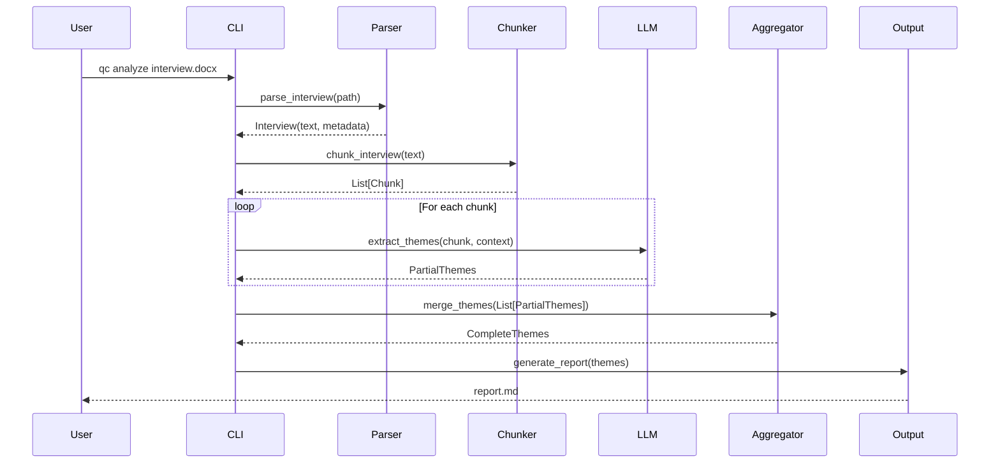

# Next Steps Before TDD

## 🎯 Priority 1: Solve Core Architectural Questions

### 1. Token Management Strategy (CRITICAL)
**Must decide before any implementation:**

```python
# Option A: Sliding Window Approach
def chunk_interview_sliding_window(text: str, max_tokens: int = 200_000, 
                                  overlap: int = 10_000) -> List[Chunk]:
    """
    Chunk with overlap to maintain context
    Pro: Maintains context across boundaries
    Con: Processes some text multiple times (cost)
    """

# Option B: Semantic Chunking  
def chunk_interview_semantic(text: str, max_tokens: int = 200_000) -> List[Chunk]:
    """
    Break at natural boundaries (speaker turns, topics)
    Pro: Preserves semantic units
    Con: Chunks may be very uneven
    """

# Option C: Hybrid Approach
def chunk_interview_hybrid(text: str, max_tokens: int = 200_000) -> List[Chunk]:
    """
    Semantic breaks with size constraints
    Pro: Best of both worlds
    Con: More complex implementation
    """
```

### 2. Create ONE Complete Sequence Diagram
**Start with single interview, happy path:**



### 3. Define Exact Data Schemas

```python
from dataclasses import dataclass
from typing import List, Optional, Dict, Literal
from datetime import datetime

@dataclass
class InterviewChunk:
    """Chunk of interview for processing"""
    chunk_id: str
    interview_id: str  
    content: str
    token_count: int
    sequence_number: int
    total_chunks: int
    overlap_tokens: int
    metadata: Dict[str, any]  # Speaker, timestamp, etc

@dataclass  
class PartialThemeExtraction:
    """Results from processing one chunk"""
    chunk_id: str
    themes: List[Theme]
    confidence: float
    processing_time: float
    token_usage: Dict[str, int]
    continuation_context: Optional[str]  # For next chunk

@dataclass
class ThemeAggregationResult:
    """Merged themes from all chunks"""
    interview_id: str
    total_themes: int
    merged_themes: List[Theme]
    confidence_scores: Dict[str, float]
    processing_metadata: Dict
    contradictions: List[Contradiction]
```

### 4. Create Error Flow Diagram

```python
# Define error handling at each layer
LAYER_ERROR_HANDLING = {
    "CLI": {
        "catches": ["ALL"],
        "displays": "User-friendly message",
        "logs": "Full stack trace",
        "recovery": "Suggest fixes"
    },
    "Processing": {
        "catches": ["ParseError", "ChunkError", "AggregationError"],
        "propagates": ["LLMError", "SystemError"],
        "recovery": "Partial result return"
    },
    "LLM": {
        "catches": ["RateLimit", "Timeout", "InvalidResponse"],
        "retries": 3,
        "backoff": "exponential",
        "propagates": ["APIKeyError", "ServiceDown"]
    }
}
```

## 🎯 Priority 2: Minimum Viable Workflow

### Define the Simplest Complete Path
1. Single interview file
2. No chunking needed (<200K tokens)
3. One-pass extraction  
4. Basic markdown output
5. No batching, no concurrency

### Create Detailed Specs for MVP:
```yaml
MVP Workflow:
  Input: 
    - Single DOCX file
    - <200K tokens
  Process:
    - Extract text
    - Single LLM call
    - Parse response
    - Generate report
  Output:
    - Markdown file
    - JSON backup
  Errors:
    - File not found
    - Invalid format
    - LLM timeout
    - Parse failure
```

## 🎯 Priority 3: Write Component Specifications

### Example: Interview Parser Specification
```python
class InterviewParserSpec:
    """
    Complete specification for interview parser component
    """
    
    # Inputs
    supported_formats = [".docx", ".txt", ".pdf"]
    max_file_size_mb = 50
    encoding = "utf-8"
    
    # Processing
    def parse_interview(self, file_path: Path) -> Interview:
        """
        Returns:
            Interview with:
            - text: Full text content
            - metadata: Extracted from document properties
            - sections: List of document sections
            - word_count: Total words
            - estimated_tokens: ~word_count * 1.3
            
        Raises:
            FileNotFoundError: If file doesn't exist
            UnsupportedFormatError: If not .docx/.txt/.pdf
            FileTooLargeError: If over max_size
            CorruptFileError: If can't parse
            EncodingError: If can't decode text
        """
        
    # Validation
    def validate_content(self, interview: Interview) -> ValidationResult:
        """
        Checks:
        - Minimum length (>100 words)
        - Language detection
        - Interview markers (questions, responses)
        - Encoding issues
        """
```

## 🚦 Readiness Checklist

Before starting TDD, we need:

- [ ] Token chunking strategy decided
- [ ] Complete sequence diagram for MVP
- [ ] Exact data schemas defined
- [ ] Error propagation paths mapped
- [ ] API contracts specified (not just interfaces)
- [ ] One complete workflow documented
- [ ] Component interactions detailed

## 📋 Recommended Next Action

**STOP and DESIGN**: Take 2-3 days to:
1. Research how Gemini handles long contexts in practice
2. Test token counting and chunking strategies
3. Map the MVP workflow in complete detail
4. Define exact API contracts for MVP components
5. Create detailed error hierarchy

Only THEN start writing tests, because tests encode design decisions - and we haven't made the critical ones yet!